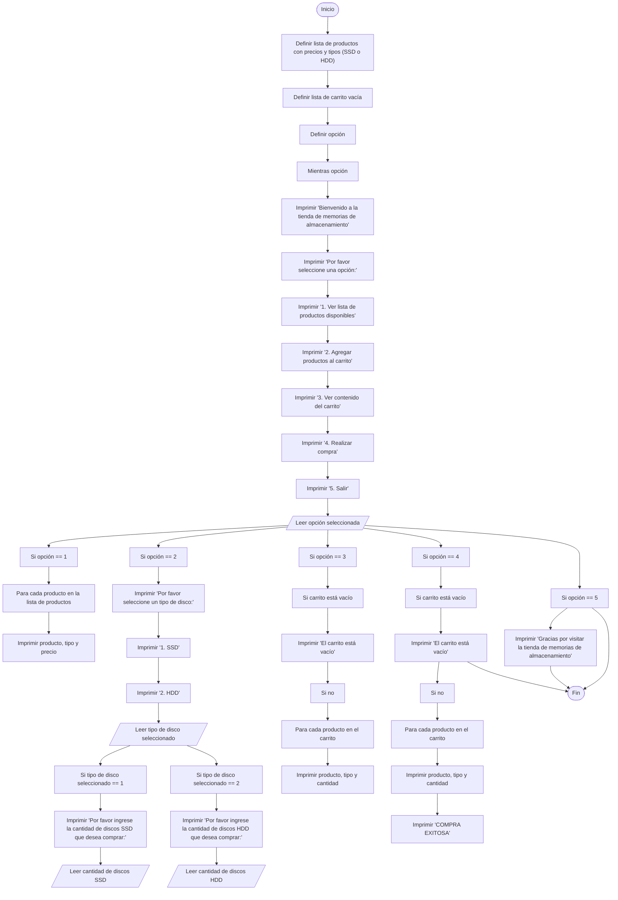

# Proyecto 
> Creado por: Daniel Felipe Ortega Gutiérrez

## Ejercicio

En su labor como programador de software, ha sido seleccionado para desarrollar una aplicación para el dueño de una tienda de venta de memorias de almacenamiento. El dueño desea implementar un sistema que permita a los clientes comprar discos de almacenamiento y agregarlos a un carrito virtual. La tienda ofrece dos tipos de discos de almacenamiento: discos SSD de 1TB a 200.000 pesos y discos HDD de 1TB a 100.000 pesos. 

La aplicación debe permitir al cliente:
- Ver una lista de productos disponibles con su precio y tipo (SSD o HDD).
- Seleccionar el tipo y la cantidad de discos que desea comprar.
- Agregar los discos seleccionados al carrito virtual.
- Ver el contenido actual del carrito virtual con la cantidad y tipo de discos y su precio total.
- Realizar la compra del contenido del carrito virtual. 

Se aclara que para mantener la simplicidad del ejemplo no se contemplan manejar persistencia en el almacenamiento de los datos y no se realiza validación ni verificación de calidad en los datos ingresados. 

  

## Menu

- [Historia De Usuario](#Historia-De-Usario)
- [Aproximacion caso de uso](#Aproximación-caso-de-uso)
- [Diagrama de flujo](#Diagrama-de-flujo)
- [Seudocodigo](#Pseudocódigo)
- [Código](#Código)

  

## Historia De Usario
[PDF](/Adicionales/Arch.pdf)

    <link>https://danielortega.atlassian.net</link>
    <title>[MEM-2] HU_Creación proyecto </title>
    <link>https://danielortega.atlassian.net/browse/MEM-2</link>
      
    <description>
        
Yo COMO dueño de una tienda de venta de memorias de almacenamiento, QUIERO una aplicación que permita a mis clientes comprar discos de almacenamiento y agregarlos a un carrito virtual, PARA que puedan realizar sus compras de manera fácil y eficiente.

        
Criterios a tener en cuenta:

        <ul>
            <li>El cliente debe poder ver una lista de productos disponibles con su precio y tipo (SSD o HDD).</li>
            <li>El cliente debe poder seleccionar el tipo y la cantidad de discos que desea comprar.</li>
            <li>El cliente debe poder agregar los discos seleccionados al carrito virtual.</li>
            <li>El cliente debe poder ver el contenido actual del carrito virtual, con la cantidad y tipo de discos y su precio total.</li>
            <li>El cliente debe poder realizar la compra del contenido del carrito virtual.</li>
            <li>La aplicación no debe manejar persistencia en el almacenamiento de los datos.</li>
            <li>No se realizará validación ni verificación de calidad en los datos ingresados para mantener la simplicidad del ejemplo.</li>
        </ul>
        
Escenario de usuario:

        
Given que soy un cliente de la tienda de memorias de almacenamiento y tengo acceso a la aplicación para comprar discos de almacenamiento,

        
When abro la aplicación y selecciono la opción de ver los productos disponibles,

        
Then puedo ver una lista de los productos disponibles con su precio y tipo (SSD o HDD).

        
When selecciono el tipo y la cantidad de discos que quiero comprar,

        
Then puedo agregar los discos seleccionados al carrito virtual.

        
When reviso el contenido actual del carrito virtual,

        
Then puedo ver la cantidad y tipo de discos seleccionados y su precio total.

        
When decido realizar la compra del contenido del carrito virtual,

        
Then la aplicación me muestra el costo total de la compra y me permite confirmar la compra.

    </description>
    

  

## Aproximación caso de uso

### Nombre: Comprar discos de almacenamiento en tienda virtual 
#### Actores: 
- Cliente 

#### Propósito: 
Permitir que los clientes compren discos de almacenamiento en una tienda virtual.

#### Curso Normal de Eventos: 
1. El cliente abre la aplicación de la tienda virtual y selecciona la opción "ver productos disponibles".
2. La aplicación muestra una lista de los productos disponibles con su precio y tipo (SSD o HDD).
3. El cliente selecciona el tipo y la cantidad de discos que desea comprar y los agrega al carrito virtual.
4. La aplicación muestra al cliente el contenido actual del carrito virtual con la cantidad y tipo de discos y su precio total.
5. El cliente decide realizar la compra del contenido del carrito virtual y la aplicación muestra el costo total de la compra.
6. El cliente confirma la compra y realiza el pago correspondiente.

#### Postcondiciones: 
- El cliente ha realizado una compra de discos de almacenamiento en la tienda virtual. 

  

## Diagrama de flujo

     

  

## Pseudocódigo 

    
    Inicio
    Definir una lista de productos con sus precios y tipos (SSD o HDD)
    Definir una lista de carrito vacía 
    Definir opción

        Mientras opción:
            Imprimir "Bienvenido a la tienda de memorias de almacenamiento"
            Imprimir "Por favor seleccione una opción:"
            Imprimir "1. Ver lista de productos disponibles"
            Imprimir "2. Agregar productos al carrito"
            Imprimir "3. Ver contenido del carrito"
            Imprimir "4. Realizar compra"
            Imprimir "5. Salir"
            Leer la opción seleccionada

        Si opción == 1:
            Para cada producto en la lista de productos:
                Imprimir el producto, su tipo y su precio

        Si opción == 2:
            Imprimir "Por favor seleccione un tipo de disco: "
            Imprimir "1. SSD"
            Imprimir "2. HDD"
            Leer el tipo de disco seleccionado

            Si tipo de disco seleccionado == 1:
                Imprimir "Por favor ingrese la cantidad de discos SSD que desea comprar: "
                Leer la cantidad de discos SSD que desea comprar
                Agregar la cantidad de discos SSD al carrito

            Si tipo de disco seleccionado == 2:
                Imprimir "Por favor ingrese la cantidad de discos HDD que desea comprar: "
                Leer la cantidad de discos HDD que desea comprar
                Agregar la cantidad de discos HDD al carrito

        Si opción == 3:
            Si el carrito está vacío:
                Imprimir "El carrito está vacío"
            Si no:
                Para cada producto en el carrito:
                    Imprimir el producto, su tipo y su cantidad

        Si opción == 4:
            Si el carrito está vacío:
                Imprimir "El carrito está vacío"
            Si no:
                Para cada producto en el carrito:
                    Imprimir el producto, su tipo y su cantidad
                Imprimir "COMPRA EXITOSA"

        Si opción == 5:
            Imprimir "Gracias por visitar la tienda de memorias de almacenamiento"
            Romper el ciclo
    Fin.

  

## Código
| Estructurado |  |
|----|----|
| [VER Codigo](/Java/Project.java)  

